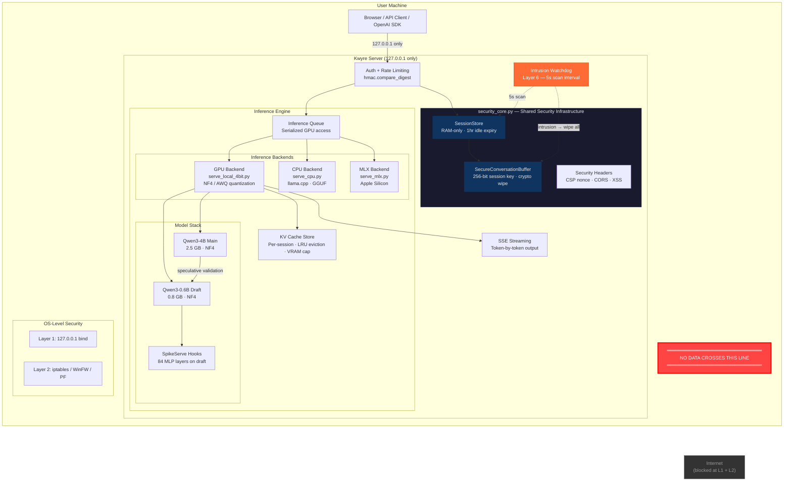
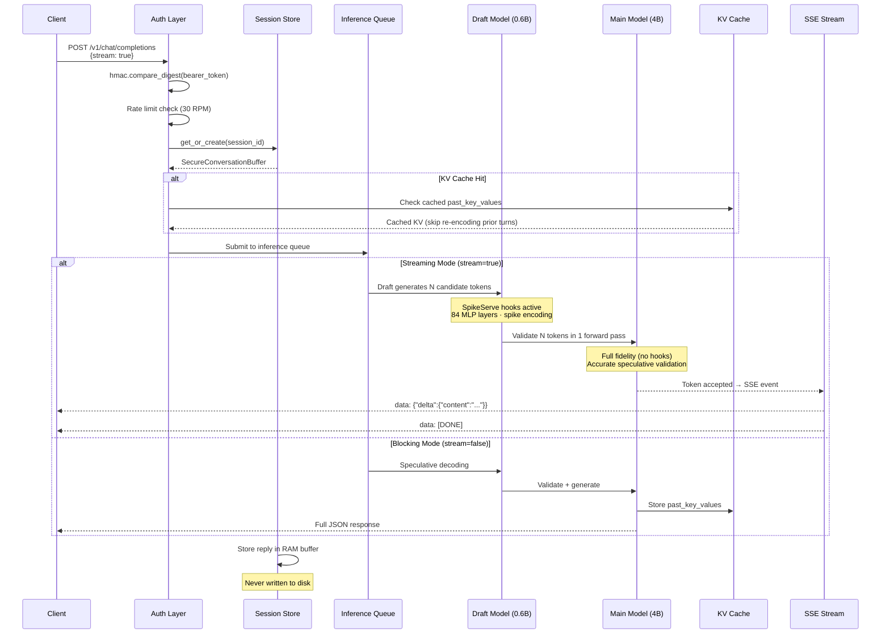
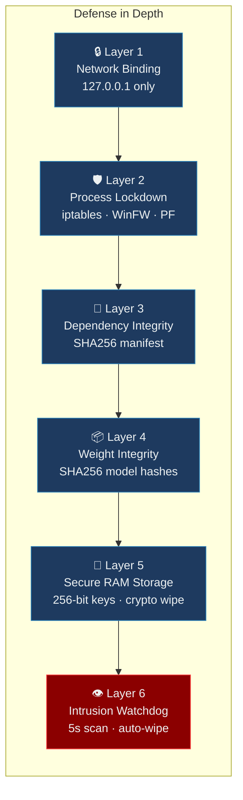
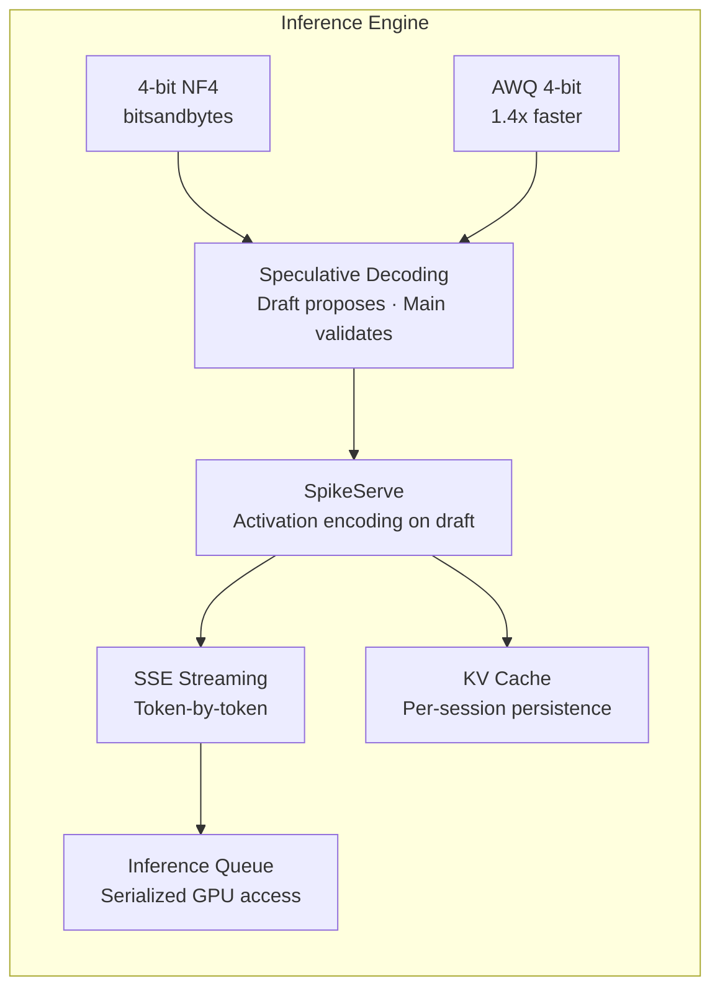
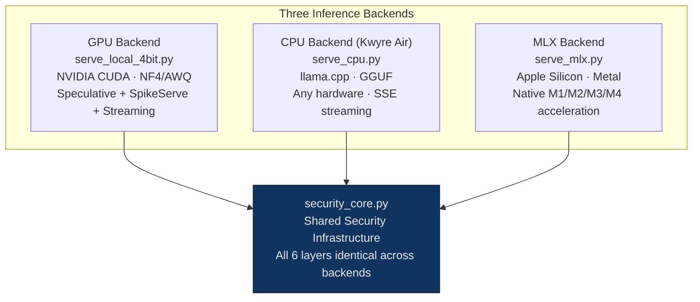
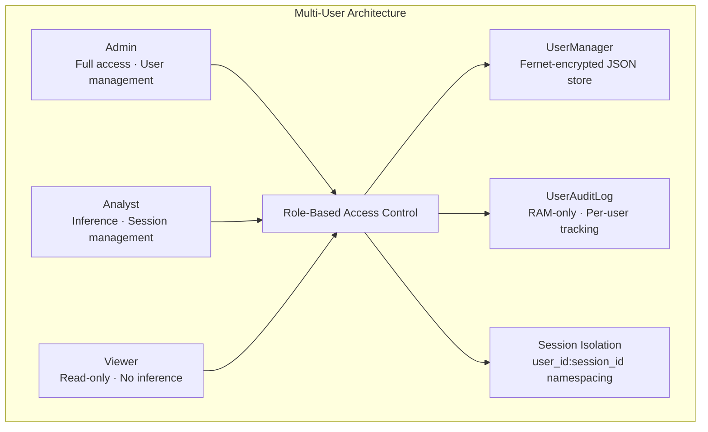
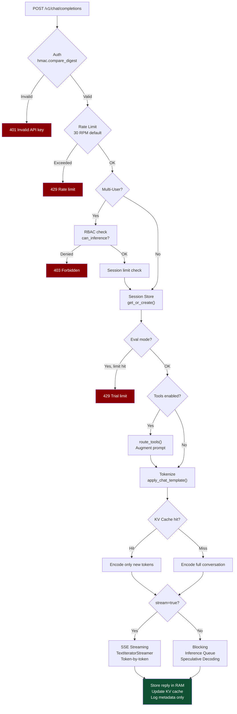

# Kwyre AI
### Air-Gapped Inference for Analysts Who Cannot Afford a Breach

> The only local AI that protects your data **even if your machine is compromised.**

[](LICENSE)
[](https://huggingface.co/Qwen)
[]()
[]()
[]()
[]()
[]()
[]()

---

## What Is Kwyre

Kwyre is a locally-deployed AI inference system built for professionals who work with data that **cannot leave the room** — active federal investigations, attorney-client privileged documents, regulated financial records, classified-adjacent work product, and sensitive compliance analysis.

It is not a hobbyist local model runner. It is a **certified, auditable, breach-resistant AI appliance** that runs entirely on your hardware, with cryptographic session wiping, intrusion detection, and a compliance documentation package built in.

**Your queries never leave your machine. Not to a cloud. Not to us. Not to anyone.**

---

## Who It's For

| Buyer | Pain Point | Why Kwyre |
|-------|-----------|-----------|
| **Forensic investigators** | Cannot upload $3B fraud evidence to ChatGPT during an active federal case | Full local inference, zero telemetry, no chain-of-custody risk |
| **Criminal defense attorneys** | Attorney-client privilege prohibits cloud AI on case materials | Air-gapped by architecture, not policy |
| **M&A law firms** | Associates uploading NDA-protected deal docs to ChatGPT is malpractice liability | Verified zero outbound connections, auditable |
| **Reinsurance / insurance underwriters** | Actuarial models, treaty structures, cedent PII cannot touch cloud APIs | Compliance documentation package for your legal team |
| **Cleared defense contractors** | Sensitive unclassified data — can't use classified AI, can't use ChatGPT | Local, offline, no cleared facility required |
| **Forensic accountants** | SEC whistleblower cases, active DOJ investigations — evidence integrity is paramount | RAM-only storage, cryptographic wipe on session end |
| **Investigative journalists** | Source protection — subscription records are subpoenable | Monero payments, no account required, no email required |

---

## System Architecture



---

## Inference Pipeline



---

## Security Stack — 6 Layers



### Layer 1 — Network Isolation
- Server binds to `127.0.0.1` only — **physically unreachable from any network** at the OS level
- No firewall rules required — the OS itself blocks all external connections
- Docker mode: container binds to `0.0.0.0` but port mapping restricts to `127.0.0.1:8000` on host

### Layer 2 — Process-Level Network Lockdown
- **Linux/WSL2:** iptables rules scoped to a dedicated `kwyre` system user — all outbound traffic blocked except `127.0.0.1`
- **Windows:** Windows Firewall rules targeting the specific Python executable — outbound blocked, localhost allowed
- **macOS:** PF firewall rules — process-level outbound restriction
- Even a fully compromised server process **cannot make outbound connections**

### Layer 3 — Dependency Integrity
- SHA256 hash manifest of every installed Python package generated on clean install
- Verified at server startup — tampered `torch`, `transformers`, or any dependency causes immediate abort
- Supply chain attacks caught before a single token is generated

### Layer 4 — Model Weight Integrity
- SHA256 hashes of all model config files verified at every startup
- Tampered or replaced model weights cause immediate process abort
- Pre-quantized Kwyre models are trusted-source — skip hash check when using official distribution

### Layer 5 — Secure RAM Session Storage
- Conversations stored **only in RAM** — never written to disk under any circumstances
- Each session gets a unique 256-bit random key
- On session end: `secure_wipe()` overwrites all message content with random bytes before clearing
- Sessions auto-expire after 1 hour of inactivity
- On server shutdown: all active sessions and KV caches wiped before process exits
- `POST /v1/session/end` — user-initiated cryptographic wipe

### Layer 6 — Intrusion Detection + Auto-Wipe
- Background watchdog thread runs every 5 seconds
- Monitors for **unexpected outbound connections** from the inference process and its children
- Monitors for **known analysis/injection tools** (Wireshark, x64dbg, Fiddler, OllyDBG, Process Hacker, Ghidra, IDA, etc.)
- Two consecutive violations required before triggering — prevents false positives
- **On confirmed intrusion: all sessions wiped immediately, KV cache destroyed, server process terminated**

---

## Core Features

### Inference Engine



- **Qwen3-4B main model** — pre-quantized to 4-bit NF4 (2.5 GB download), fine-tuned for legal/financial/forensic analysis
- **Qwen3-0.6B draft model** — speculative decoding for 2-3x speed boost (0.8 GB download)
- **Total model download: 3.3 GB** — clients download pre-quantized weights from kwyre.com, not HuggingFace
- **Spike QAT (Quantization-Aware Training)** — custom fine-tuning pipeline using Straight-Through Estimator spike encoding with k-curriculum annealing (k=50 to 5)
- **SpikeServe activation encoding** — dynamic spike encoding on the **draft model** (84 MLP layers), main model runs at full fidelity for accurate speculative validation
- **Speculative decoding** — Qwen3-0.6B draft model generates candidate tokens, Qwen3-4B main model validates in parallel
- **SSE streaming** — token-by-token output via Server-Sent Events; `"stream": true` in request body
- **KV cache persistence** — per-session cache stores `past_key_values` so follow-up messages skip re-encoding prior conversation (LRU eviction, configurable VRAM cap)
- **Inference queue** — serialized GPU access with proper concurrency handling; HTTP threads stay responsive during generation
- **4-bit NF4 quantization** (bitsandbytes) — both models fit in ~3.9 GB VRAM combined
- **AWQ quantization option** — `KWYRE_QUANT=awq` for 1.4x faster inference when pre-quantized
- **OpenAI-compatible API** — `POST /v1/chat/completions` drop-in replacement, works with any OpenAI SDK
- **Multi-tier support** — switch between 4B (personal, 3.5 GB VRAM) and 9B (professional, 7.5 GB VRAM) via environment variable

### Multi-Backend Support



All three backends share the same `security_core.py` — identical security stack, identical API shape, identical HTML frontend. Choose your backend based on hardware.

### Performance

| Metric | GPU 4B + Speculative | GPU 9B | CPU (Kwyre Air) | MLX (Apple Silicon) |
|--------|---------------------|--------|-----------------|---------------------|
| VRAM / RAM | 3.9 GB VRAM | 8.1 GB VRAM | 4-8 GB RAM | 4-8 GB unified |
| Model load | ~1 second | ~3 seconds | ~5 seconds | ~3 seconds |
| Inference | 7-14 tok/s | 3-5 tok/s | 2-8 tok/s | 5-15 tok/s |
| Download | 3.3 GB | 7.6 GB | 2-4 GB (GGUF) | 2-4 GB (MLX) |
| GPU required | Yes (NVIDIA) | Yes (NVIDIA) | No | No (Apple Silicon) |

### Security Hardening (v0.3 — Pentest Verified)

Kwyre v0.3 underwent a full white-box security audit and penetration test. All 47 findings (9 Critical, 12 High, 14 Medium, 12 Low/Info) were resolved:

- **True air-gap enforcement** — External API tools opt-in via `KWYRE_ENABLE_TOOLS=1` (default OFF)
- **CSP nonce-based script protection** — Per-request cryptographic nonces; `cdn.jsdelivr.net` restricted to payment page only
- **Timing-safe authentication** — `hmac.compare_digest` prevents timing side-channel attacks
- **Input validation** — `max_tokens` 1-8192, `temperature` 0.0-2.0, `top_p` 0.0-1.0, message arrays max 100
- **License key injection blocked** — Public key embedded at build time, not loadable from env
- **Eval tier enforcement** — 10 req/min, 512 max tokens, 3 requests per IP
- **Security headers on all responses** — `X-Frame-Options: DENY`, `X-Content-Type-Options: nosniff`, `Referrer-Policy`, `Permissions-Policy`, full CSP
- **mXSS-safe HTML sanitization** — DOMParser-based sanitizer
- **Non-root Docker container** — Dedicated `kwyre` user with minimal privileges
- **Session storage hardening** — `sessionStorage` (cleared on tab close), not `localStorage`
- **Session ID hardening** — Minimum 32-character entropy requirement
- **Watchdog child process monitoring** — Recursive child process network scanning
- **Authenticated health endpoint** — Detailed system info requires API key
- **CORS origin restriction** — Locked to server's own origin

**Test suite: 107 tests across 3 test files, all passing.**

### Privacy Features
- **Zero content logging** — metadata only (timestamps, token counts)
- **No telemetry** — zero analytics, zero error reporting, zero update pings, zero license callbacks
- **Monero (XMR) payment option** — no payment record, no email required, fully anonymous
- **Ed25519 offline license keys** — validation works without any network call
- **Self-delete conversation** — user-initiated wipe via API, cryptographically unrecoverable
- **Open-source server code** — fully auditable; verify zero outbound yourself with Wireshark

### Multi-User Air-Gapped Mode



- **Encrypted user storage** — Fernet-encrypted JSON file with `KWYRE_MASTER_KEY`
- **RBAC roles** — admin (full access), analyst (inference + sessions), viewer (read-only)
- **Per-user session isolation** — session IDs namespaced as `user_id:session_id`
- **Per-user rate limits** — configurable RPM per user
- **Per-user session limits** — configurable max concurrent sessions
- **Admin API endpoints** — create/delete users, wipe sessions, view audit logs
- **RAM-only audit log** — tracks requests, rate limit hits, failed auth, security events

### Compliance & Audit
- `GET /audit` — metadata-only compliance log with security control attestation
- `GET /health` — full security stack status including watchdog, KV cache, streaming, and VRAM usage
- **SOC2 deployment guide** — `docs/SOC2_DEPLOYMENT_GUIDE.md` maps Kwyre layers to Trust Service Criteria
- **Enterprise audit package** — `docs/ENTERPRISE_AUDIT.md` covers audit specs, data flow, crypto controls, pentest summary
- **Compliance letter** — formal attestation for GDPR, HIPAA, SOC 2, FINRA, ITAR, FRE, ABA
- Architecture designed to satisfy HIPAA, FINRA, attorney-client privilege, and SOC2-adjacent requirements

---

## API Endpoints

```
POST /v1/chat/completions   OpenAI-compatible inference (stream=true for SSE)
POST /v1/session/end        Cryptographic session + KV cache wipe
POST /v1/license/verify     Offline license key validation
GET  /health                Status + KV cache + watchdog + spike stats
GET  /audit                 Metadata-only compliance log
GET  /v1/models             Model info + capabilities
GET  /                      Landing page
GET  /chat                  Browser UI (SSE streaming)

Admin endpoints (multi-user mode only, admin role required):
GET    /v1/admin/users          List users
POST   /v1/admin/users          Create user
DELETE /v1/admin/users/{name}   Delete user + wipe sessions + evict KV
GET    /v1/admin/sessions       List sessions
POST   /v1/admin/sessions/wipe  Wipe user sessions + evict KV
GET    /v1/admin/audit          Per-user audit stats
```

---

## Hardware Requirements

| Config | GPU | VRAM | RAM | Speed | Download |
|--------|-----|------|-----|-------|----------|
| Recommended (4B GPU) | RTX 4060+ | 4GB+ | 8GB | 7-14 tok/s | 3.3 GB |
| Professional (9B GPU) | RTX 4090 / 3090 | 8GB+ | 8GB | 3-5 tok/s | 7.6 GB |
| Kwyre Air (CPU) | None | — | 8GB+ | 2-8 tok/s | 2-4 GB |
| Apple Silicon (MLX) | None (M1/M2/M3/M4) | — | 8GB+ | 5-15 tok/s | 2-4 GB |

---

## Quick Start

### Option 1: One-Click Installer (recommended)

**Windows:**
```powershell
powershell -ExecutionPolicy Bypass -File installer\install_windows.ps1
```

**Linux (Ubuntu/Debian):**
```bash
sudo bash installer/install_linux.sh
sudo systemctl start kwyre
```

**macOS:**
```bash
sudo bash installer/install_macos.sh
sudo launchctl start com.kwyre.ai.server
```

### Option 2: Docker
```bash
git clone https://github.com/blablablasealsaresoft/kwyre-ai
cd kwyre-ai && cp .env.example .env
docker compose up
```

### Option 3: Direct Python
```bash
git clone https://github.com/blablablasealsaresoft/kwyre-ai
cd kwyre-ai
pip install -r requirements-inference.txt

# Place pre-quantized models in dist/
python server/serve_local_4bit.py
```

### Option 3b: Kwyre Air (CPU — any hardware)
```bash
KWYRE_GGUF_PATH=./models/kwyre-4b.gguf python server/serve_cpu.py
```

### Option 3c: MLX (Apple Silicon)
```bash
python model/convert_mlx.py --model Qwen/Qwen3-4B --output ./models/kwyre-4b-mlx
python server/serve_mlx.py
```

### Option 3d: Multi-user mode
```bash
python server/users.py init
KWYRE_MULTI_USER=1 python server/serve_local_4bit.py
```

### Test

```bash
# Health check
curl http://127.0.0.1:8000/health

# Blocking inference
curl -X POST http://127.0.0.1:8000/v1/chat/completions \
  -H "Authorization: Bearer sk-kwyre-dev-local" \
  -H "Content-Type: application/json" \
  -d '{"messages": [{"role": "user", "content": "Summarize NDA obligations."}], "max_tokens": 512}'

# Streaming inference (SSE)
curl -N -X POST http://127.0.0.1:8000/v1/chat/completions \
  -H "Authorization: Bearer sk-kwyre-dev-local" \
  -H "Content-Type: application/json" \
  -d '{"messages": [{"role": "user", "content": "Analyze this contract clause."}], "stream": true}'

# Wipe session
curl -X POST http://127.0.0.1:8000/v1/session/end \
  -H "Authorization: Bearer sk-kwyre-dev-local" \
  -H "Content-Type: application/json" \
  -d '{"session_id": "case-001"}'
```

---

## Configuration

| Variable | Default | Description |
|----------|---------|-------------|
| `KWYRE_BACKEND` | `gpu` | Inference backend: `gpu`, `cpu`, or `mlx` |
| `KWYRE_MODEL` | `Qwen/Qwen3-4B` | Model tier (`Qwen/Qwen3-4B` or `Qwen/Qwen3.5-9B`) |
| `KWYRE_MODEL_PATH` | auto-detect | Path to pre-quantized model directory |
| `KWYRE_DRAFT_PATH` | auto-detect | Path to pre-quantized draft model directory |
| `KWYRE_GGUF_PATH` | — | Path to GGUF model for CPU mode |
| `KWYRE_AWQ_MODEL_PATH` | — | Path to pre-quantized AWQ model |
| `KWYRE_CTX_LENGTH` | `8192` | Context length for CPU mode |
| `KWYRE_SPECULATIVE` | `1` | Enable speculative decoding with draft model |
| `KWYRE_QUANT` | `nf4` | Quantization mode (`nf4` or `awq`) |
| `KWYRE_KV_CACHE_MAX` | `8` | Max sessions with cached KV state |
| `KWYRE_KV_CACHE_VRAM_GB` | `2.0` | VRAM budget for KV cache (GB) |
| `KWYRE_API_KEYS` | `sk-kwyre-dev-local:admin` | API key:role pairs |
| `KWYRE_MULTI_USER` | `0` | Multi-user air-gapped mode |
| `KWYRE_USERS_FILE` | `users.json` | Encrypted users file path |
| `KWYRE_MASTER_KEY` | — | Fernet key for users file encryption |
| `KWYRE_MERGE_LORA` | `0` | Merge LoRA adapters at load |
| `KWYRE_LICENSE_KEY` | — | Commercial license key |
| `KWYRE_ENABLE_TOOLS` | `0` | Enable external API tools (**breaks air-gap**) |
| `KWYRE_BIND_HOST` | `127.0.0.1` | Network bind address |

---

## Pricing

| License | Price | Machines | Includes |
|---------|-------|----------|----------|
| **Personal** | $299 one-time | 1 | Model + server + compliance doc |
| **Professional** | $799 one-time | 3 | Everything + priority support + 9B model |
| **Air-Gapped Kit** | $1,499 one-time | 5 | Offline installer + full audit package |

**Payment:** Credit card or Monero (XMR). No email required for Monero purchases. One-time — no subscription.

---

## Roadmap

**v0.1 (Complete)**
- [x] Qwen3.5-9B + Spike QAT training pipeline
- [x] 6-layer security stack
- [x] OpenAI-compatible API
- [x] Session encryption + cryptographic wipe
- [x] Intrusion detection watchdog
- [x] Compliance documentation package

**v0.2 (Complete)**
- [x] Pre-quantized NF4 model distribution (3.3 GB total download)
- [x] Speculative decoding with Qwen3-0.6B draft model (2-3x speed)
- [x] Qwen3-4B tier (3.9 GB VRAM for both models combined)
- [x] Docker installer (`docker compose up`)
- [x] Monero payment integration + Ed25519 offline license keys
- [x] Multi-tier model support (4B personal / 9B professional)
- [x] Inference-only dependency set (stripped training deps for lean install)

**v0.3 (Complete — Security Hardened)**
- [x] Full white-box penetration test — 47/47 findings resolved
- [x] True air-gap enforcement — tools opt-in, default offline
- [x] CSP nonce-based script protection (removed `unsafe-inline`)
- [x] Timing-safe API key authentication (`hmac.compare_digest`)
- [x] Input validation and eval tier enforcement
- [x] Non-root Docker container with dependency manifest
- [x] DOMParser-based HTML sanitization (mXSS-safe)
- [x] Security headers on all HTTP response paths
- [x] Watchdog child process monitoring
- [x] 107 security tests across 3 test suites
- [x] Windows, Linux, and macOS one-click installers
- [x] Nuitka build pipeline — compiled binary distribution (source protection)

**v0.4 (Complete)**
- [x] Apple Silicon / MLX support — `server/serve_mlx.py` with `model/convert_mlx.py`
- [x] CPU-only mode via llama.cpp — `server/serve_cpu.py` (Kwyre Air) with `model/convert_gguf.py`
- [x] AWQ quantization option — `KWYRE_AWQ_MODEL_PATH` env var, `KWYRE_QUANT=awq`
- [x] Multi-user air-gapped server mode — `server/users.py`, `server/audit.py`, `KWYRE_MULTI_USER=1`
- [x] Domain-specific fine-tune pipeline — `finetune/` directory
- [x] Benchmark suite vs GPT-4o — `benchmarks/` directory
- [x] SOC2-friendly deployment guide — `docs/SOC2_DEPLOYMENT_GUIDE.md`
- [x] Enterprise audit package — `docs/ENTERPRISE_AUDIT.md`
- [x] Shared security infrastructure — `server/security_core.py`

**v0.5 (Current — Performance Optimized)**
- [x] SSE streaming — token-by-token output via `TextIteratorStreamer` and Server-Sent Events
- [x] SpikeServe relocated to draft model — main model runs at full fidelity for accurate speculative validation
- [x] Lazy sparsity measurement — no startup deadlock, measured on first real request
- [x] Per-session KV cache — `past_key_values` persistence with LRU eviction and VRAM cap
- [x] Inference queue — serialized GPU access, HTTP threads stay responsive during generation
- [x] Frontend streaming UI — `chat.html` renders tokens live as they arrive

**v1.0**
- [ ] Hardware-bound license keys (machine fingerprint)
- [ ] Code signing for releases
- [ ] Windows one-click GUI installer
- [ ] Auto-update mechanism (air-gap safe — manual download)

---

## Building from Source (Nuitka Protected Binary)

```bash
pip install nuitka ordered-set zstandard

python build.py all          # Compile + package + installer

# Or step by step:
python build.py compile      # Nuitka → build/kwyre-dist/kwyre-server[.exe]
python build.py package      # Stage data files
python build.py installer    # Platform installer (.exe/.deb/.pkg)
python build.py clean        # Clean artifacts
```

**What gets compiled (protected):**
- `server/serve_local_4bit.py` — inference server, streaming, KV cache, security layers
- `server/tools.py` — external API tool router
- `security/verify_deps.py` — Layer 3 dependency integrity
- `security/license.py` — Ed25519 license validation
- `model/spike_serve.py` — SpikeServe inference encoding

**Build outputs:**

| Platform | Installer | Format |
|----------|-----------|--------|
| Windows | Inno Setup | `.exe` |
| Linux | Debian package + AppImage | `.deb` / `.AppImage` |
| macOS | macOS package | `.pkg` |

---

## Technical Specifications

```
Main model:          Qwen3-4B (pre-quantized NF4, 2.5 GB)
Draft model:         Qwen3-0.6B (pre-quantized NF4, 0.8 GB)
Speculative:         Enabled by default (2-3x throughput)
SpikeServe:          84 MLP layers on draft model, main at full fidelity
Quantization:        4-bit NF4 (bitsandbytes) or AWQ (1.4x faster)
Compute dtype:       bfloat16
VRAM at inference:   ~3.9 GB (both models + KV cache budget)
KV cache:            Per-session, LRU eviction, 2 GB VRAM cap default
Streaming:           SSE (text/event-stream), token-by-token
Concurrency:         Inference queue (serialized GPU) + threaded HTTP
Context length:      8192 tokens
API compatibility:   OpenAI /v1/chat/completions (blocking + streaming)
Docker image:        ~10 GB (includes CUDA runtime)
Model download:      3.3 GB (pre-quantized, from kwyre.com)

Available tiers:
  Personal:    Qwen3-4B   — 3.5 GB VRAM, 7-14 tok/s
  Professional: Qwen3.5-9B — 7.5 GB VRAM, 3-5 tok/s

QAT Training (9B):
  LoRA rank:         64 (alpha 128)
  LoRA targets:      gate_proj, up_proj, down_proj (MLP only)
  Spike hooks:       408 layers (main model training)
  k-curriculum:      50.0 → 5.0 (step schedule)
  Dataset:           teknium/OpenHermes-2.5
```

---

## Request / Response Flow



---

## Verifying Zero Telemetry

**Windows:**
```
Task Manager → Performance → Open Resource Monitor → Network tab → filter python.exe
Confirm: only 127.0.0.1 connections
```

**Linux/WSL2:**
```bash
watch -n 1 "ss -tp | grep python"
```

**Wireshark:**
```
Interface: loopback (lo) | Filter: tcp.port == 8000
Confirm: all traffic is 127.0.0.1 → 127.0.0.1
```

---

## Compliance Documentation

- **`docs/COMPLIANCE_LETTER.md`** — formal attestation (GDPR, HIPAA, SOC 2, FINRA, ITAR, FRE, ABA)
- **`docs/VERIFICATION_GUIDE.md`** — independent security verification for each layer
- **`docs/DEPLOYMENT_CHECKLIST.md`** — hardened deployment procedure
- **`docs/INCIDENT_RESPONSE.md`** — security event classification and response
- **`docs/SOC2_DEPLOYMENT_GUIDE.md`** — SOC2 Type II deployment guide
- **`docs/ENTERPRISE_AUDIT.md`** — enterprise audit package

---

## Project Structure

```
kwyre/
├── server/
│   ├── serve_local_4bit.py    # GPU inference (streaming, KV cache, speculative)
│   ├── serve_cpu.py           # CPU inference via llama.cpp (Kwyre Air)
│   ├── serve_mlx.py           # Apple Silicon inference via MLX
│   ├── security_core.py       # Shared security infrastructure (all 6 layers)
│   ├── users.py               # Multi-user management (Fernet-encrypted)
│   └── audit.py               # Per-user audit logging (RAM-only)
├── model/
│   ├── spike_serve.py         # SpikeServe activation encoding hooks
│   ├── quantize_nf4.py        # NF4 pre-quantization script
│   ├── convert_gguf.py        # HuggingFace → GGUF converter
│   └── convert_mlx.py         # HuggingFace → MLX converter
├── security/
│   ├── verify_deps.py         # Layer 3 — dependency integrity
│   └── license.py             # Ed25519 offline license validation
├── chat/
│   ├── landing.html           # Marketing landing page
│   ├── chat.html              # Chat UI (SSE streaming)
│   ├── main.html              # Main product page
│   └── pay.html               # Payment + license download gate
├── installer/
│   ├── install_windows.ps1    # Windows installer
│   ├── install_linux.sh       # Linux installer (systemd + iptables)
│   └── install_macos.sh       # macOS installer (launchd + PF)
├── finetune/                  # Domain-specific fine-tuning pipeline
├── benchmarks/                # Benchmark suite vs GPT-4o
├── docs/                      # Compliance documentation package
├── tests/                     # 107 security tests
├── build.py                   # Nuitka build + installer pipeline
└── dist/                      # Pre-quantized model weights
    ├── kwyre-4b-nf4/          # Main model (2.5 GB)
    └── kwyre-draft-nf4/       # Draft model (0.8 GB)
```

---

## Security Disclosure

Found a vulnerability? Email security@kwyre.ai.

We do not use a bug bounty program. We will acknowledge responsible disclosure publicly and fix issues immediately.

---

## License

MIT License. Use it, audit it, fork it.

The model weights (Qwen3-4B, Qwen3-0.6B base) are licensed under Apache 2.0 by Alibaba. LoRA adapters and pre-quantized distributions are original work, MIT licensed.

---

## Built By

APOLLO CyberSentinel LLC — blockchain forensics, cryptocurrency fraud investigation, OSINT analysis.

We built this because we needed it ourselves. We cannot upload active federal investigation evidence to OpenAI. Neither can you.

---

*All inference runs 100% locally. No data leaves your machine.*
*We are not lawyers. This is not legal advice. Verify your own compliance requirements.*
