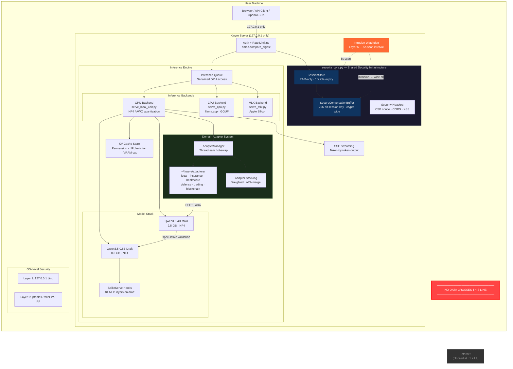
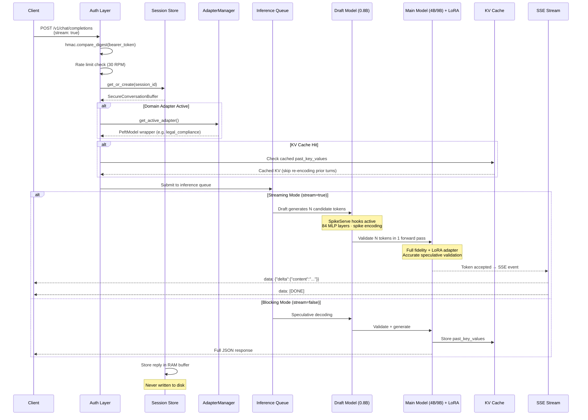
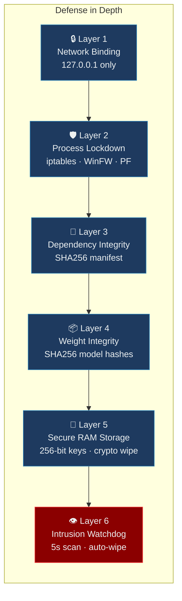
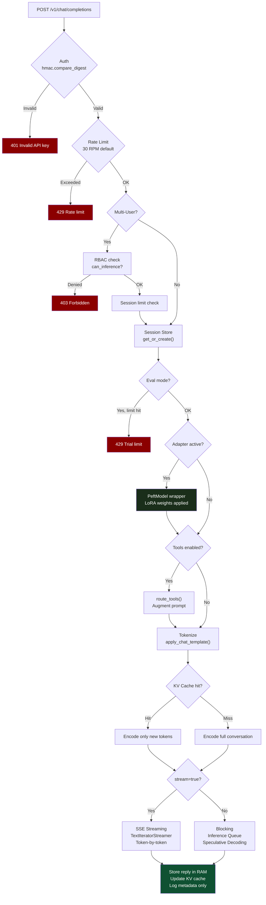

# Kwyre AI
### Air-Gapped Inference for Analysts Who Cannot Afford a Breach

> The only local AI that protects your data **even if your machine is compromised.**

[](LICENSE)
[](https://huggingface.co/Qwen)
[]()
[]()
[]()
[]()
[]()
[]()
[]()
[]()

---

## What Is Kwyre

Kwyre is a locally-deployed AI inference system built for professionals who work with data that **cannot leave the room** — active federal investigations, attorney-client privileged documents, regulated financial records, classified-adjacent work product, and sensitive compliance analysis.

It is not a hobbyist local model runner. It is a **certified, auditable, breach-resistant AI appliance** that runs entirely on your hardware, with cryptographic session wiping, intrusion detection, hot-swappable domain adapters, and a compliance documentation package built in.

**Your queries never leave your machine. Not to a cloud. Not to us. Not to anyone.**

---

## Five Products, One Mission

Every Kwyre product runs 100% locally with zero data leaving your machine.

| Product | Model | Hardware | VRAM / RAM | Speed | Price | Identity |
|---------|-------|----------|-----------|-------|-------|----------|
| **Kwyre Personal** | Qwen3.5-4B + 0.8B draft | NVIDIA GPU (RTX 4060+) | 4.1 GB VRAM | 7-14 tok/s | $299 | Speed-optimized with speculative decoding, SpikeServe, RAG document ingestion, **1 domain adapter** |
| **Kwyre Professional** | Qwen3.5-9B + 0.8B draft | NVIDIA GPU (RTX 4090/3090) | 7.5 GB VRAM | 3-5 tok/s | $799 | Domain specialist — Claude-distilled reasoning + GRPO emergent problem-solving, **all 6 domain adapters** |
| **Kwyre Air** | Any GGUF model | Any CPU | 8+ GB RAM | 2-8 tok/s | $299 | Lightweight portable — runs on any hardware, no GPU required |
| **Kwyre (Apple Silicon)** | Any MLX model | M1/M2/M3/M4 Mac | 8+ GB unified | 5-15 tok/s | $299 | Native Metal acceleration, zero CUDA dependency |
| **Custom LLM** | Domain-specific (we train) | Any (we configure) | Varies | Varies | Contact | Turnkey appliance or self-hosted — legal, financial, crypto, insurance, defense, healthcare |

**All products share:** 6-layer security stack, OpenAI-compatible API, SSE streaming, cryptographic session wipe, intrusion detection, offline license validation.

**GPU products add:** Speculative decoding, SpikeServe activation encoding, per-session KV cache, RAG document ingestion, multi-user RBAC, Flash Attention 2, hot-swap domain adapters.

---

## Domain Adapters — Professional Verticals

Kwyre ships with six hot-swappable LoRA domain adapters, each trained on 1,000 Claude-generated expert reasoning traces. Adapters load onto the base model at runtime with no restart required.

### The Six Domains

| Adapter | Size | Expertise |
|---------|------|-----------|
| `legal_compliance` | ~150 MB | NDA analysis, privilege screening, SEC/FINRA compliance, M&A, contract review, Stark Law |
| `insurance_actuarial` | ~150 MB | Reinsurance treaties, loss development triangles, IBNR reserving, Solvency II/RBC, catastrophe XL |
| `healthcare_lifesciences` | ~150 MB | HIPAA/PHI, 21 CFR Parts 11/50/312, FDA 510(k), ICD-10 coding, Stark Law, clinical trials |
| `defense_intelligence` | ~150 MB | CUI handling, NIST 800-171/CMMC, MITRE ATT&CK, OSINT per ICD 203/206, OPSEC, SCRM |
| `financial_trading` | ~150 MB | Algorithmic trading, VaR/CVaR, options pricing, Reg SCI/MiFID II, HFT microstructure, factor models |
| `blockchain_crypto` | ~150 MB | On-chain tracing, MEV/sandwich attacks, RICO/BSA/AML, wallet clustering, rug pull detection, Tornado Cash analysis |

### How It Works

```
Customer installs:
  Base model (Qwen3.5-4B or Qwen3.5-9B)  →  ~2.5 GB or ~7.6 GB
  + Domain adapter (LoRA weights)          →  ~150 MB each

Runtime:
  POST /v1/adapter/load   { "domain": "legal_compliance" }
  POST /v1/adapter/unload
  GET  /v1/adapter/list
  POST /v1/adapter/stack  { "adapters": ["legal_compliance", "blockchain_crypto"], "weights": [0.6, 0.4] }
```

Adapters use PEFT LoRA — swapping takes ~2 seconds and requires no model reload. Multiple adapters can be merged with weighted combination for hybrid use cases (e.g., a crypto lawyer loading both `legal_compliance` + `blockchain_crypto`).

### Adapter Training Pipeline

Each adapter was trained using a two-phase batch process:

```
Phase 1 — Prompt expansion (Anthropic Batch API, ~$2)
  12 seed prompts × 84 expansion calls = 1,000 unique expert prompts per domain

Phase 2 — Trace generation (Anthropic Batch API, ~$30)
  6,000 trace requests submitted as single batch (50% cheaper than real-time)
  Claude-sonnet reasoning traces with <think>...</think> chain-of-thought

Phase 3 — Distillation (H100 80GB, ~3h/domain)
  Unsloth QLoRA on Qwen/Qwen3.5-4B
  LoRA rank 32, 3 epochs, 1,000 samples, seq 4096
  Loss: 1.2 → 0.53 per domain

Total cost: ~$286 for all 6 adapters
```

---

## How Kwyre Professional Compares

### Model Quality Benchmarks

| Model | Size | MMLU-Pro | GPQA Diamond | GSM8K | Context | Runs Locally |
|-------|------|----------|-------------|-------|---------|-------------|
| **Kwyre Professional** | 9B (custom-trained) | ~82.5 | ~81.7 | 95.0 | 32K | Yes (air-gapped) |
| GPT-4o | ~200B+ | ~85 | ~80 | ~95 | 128K | No (cloud only) |
| Claude Sonnet | ~70B+ | ~84 | ~78 | ~93 | 200K | No (cloud only) |
| DeepSeek R1 7B | 7B | 82.4 | — | 91.2 | 128K | Yes (no security) |
| Llama 4 Scout | 17B | 79.8 | — | 85.1 | 10M | Yes (no security) |
| Mistral 3 | 24B | 82.8 | — | — | 128K | Yes (no security) |

*Kwyre Professional inherits Qwen3.5-9B's base benchmark scores. Custom domain adapters add vertical-specific capabilities not measured by standard benchmarks.*

### What No Benchmark Measures

| Capability | Kwyre | ChatGPT | Ollama | LM Studio | Jan.ai | LocalAI |
|-----------|-------|---------|--------|-----------|--------|---------|
| **Fully local (zero network)** | Yes | No | Yes | Yes | Yes | Yes |
| **6-layer active security** | Yes | No | No | No | No | No |
| **Process-level outbound block** | Yes | No | No | No | No | No |
| **Intrusion detection + auto-wipe** | Yes | No | No | No | No | No |
| **Cryptographic session wipe** | Yes | No | No | No | No | No |
| **RAM-only storage (never disk)** | Yes | No | No | No | No | No |
| **Dependency integrity (SHA-256)** | Yes | No | No | No | No | No |
| **Model weight verification** | Yes | No | No | No | No | No |
| **Hot-swap domain adapters** | Yes | No | No | No | No | No |
| **Adapter stacking (weighted merge)** | Yes | No | No | No | No | No |
| **Compliance documentation** | Yes | No | No | No | No | No |
| **SOC2 / HIPAA / FINRA ready** | Yes | Partial | No | No | No | No |
| **Anonymous payment (Monero)** | Yes | No | N/A | N/A | N/A | N/A |
| **Custom-trained for forensics** | Yes | No | No | No | No | No |
| **RAG document ingestion** | Yes | Yes | Plugin | Plugin | Plugin | Plugin |
| **Speculative decoding** | Yes | N/A | Yes | Yes | No | No |

---

## Who It's For

| Buyer | Pain Point | Why Kwyre |
|-------|-----------|-----------|
| **Forensic investigators** | Cannot upload $3B fraud evidence to ChatGPT during an active federal case | Full local inference, zero telemetry, no chain-of-custody risk |
| **Criminal defense attorneys** | Attorney-client privilege prohibits cloud AI on case materials | Air-gapped by architecture, not policy |
| **M&A law firms** | Associates uploading NDA-protected deal docs to ChatGPT is malpractice liability | Verified zero outbound connections, auditable |
| **Reinsurance / insurance underwriters** | Actuarial models, treaty structures, cedent PII cannot touch cloud APIs | Compliance documentation package for your legal team |
| **Cleared defense contractors** | Sensitive unclassified data — can't use classified AI, can't use ChatGPT | Local, offline, no cleared facility required |
| **Forensic accountants** | SEC whistleblower cases, active DOJ investigations — evidence integrity is paramount | RAM-only storage, cryptographic wipe on session end |
| **Investigative journalists** | Source protection — subscription records are subpoenable | Monero payments, no account required, no email required |

---

## System Architecture



---

## Inference Pipeline



---

## Security Stack — 6 Layers



### Layer 1 — Network Isolation
- Server binds to `127.0.0.1` only — **physically unreachable from any network** at the OS level
- No firewall rules required — the OS itself blocks all external connections
- Docker mode: container binds to `0.0.0.0` but port mapping restricts to `127.0.0.1:8000` on host

### Layer 2 — Process-Level Network Lockdown
- **Linux/WSL2:** iptables rules scoped to a dedicated `kwyre` system user — all outbound traffic blocked except `127.0.0.1`
- **Windows:** Windows Firewall rules targeting the specific Python executable — outbound blocked, localhost allowed
- **macOS:** PF firewall rules — process-level outbound restriction
- Even a fully compromised server process **cannot make outbound connections**

### Layer 3 — Dependency Integrity
- SHA256 hash manifest of every installed Python package generated on clean install
- Verified at server startup — tampered `torch`, `transformers`, or any dependency causes immediate abort
- Supply chain attacks caught before a single token is generated

### Layer 4 — Model Weight Integrity
- SHA256 hashes of all model config files verified at every startup
- Tampered or replaced model weights cause immediate process abort
- Pre-quantized Kwyre models are trusted-source — skip hash check when using official distribution

### Layer 5 — Secure RAM Session Storage
- Conversations stored **only in RAM** — never written to disk under any circumstances
- Each session gets a unique 256-bit random key
- On session end: `secure_wipe()` overwrites all message content with random bytes before clearing
- Sessions auto-expire after 1 hour of inactivity
- On server shutdown: all active sessions and KV caches wiped before process exits
- `POST /v1/session/end` — user-initiated cryptographic wipe

### Layer 6 — Intrusion Detection + Auto-Wipe
- Background watchdog thread runs every 5 seconds
- Monitors for **unexpected outbound connections** from the inference process and its children
- Monitors for **known analysis/injection tools** (Wireshark, x64dbg, Fiddler, OllyDBG, Process Hacker, Ghidra, IDA, etc.)
- Two consecutive violations required before triggering — prevents false positives
- **On confirmed intrusion: all sessions wiped immediately, KV cache destroyed, server process terminated**

---

## Core Features

### Inference Engine

- **Qwen3.5-4B main model** — pre-quantized to 4-bit NF4 (2.5 GB download), trained for professional domain analysis
- **Qwen3.5-0.8B draft model** — speculative decoding for 2-3x speed boost (0.8 GB download)
- **Total model download: 3.3 GB** — clients download pre-quantized weights from kwyre.com
- **Spike QAT** — custom fine-tuning pipeline using Straight-Through Estimator spike encoding with k-curriculum annealing
- **SpikeServe activation encoding** — dynamic spike encoding on the **draft model** (84 MLP layers), main model runs at full fidelity
- **Speculative decoding** — Qwen3.5-0.8B draft generates candidate tokens, main model validates in parallel
- **SSE streaming** — token-by-token output via Server-Sent Events; `"stream": true` in request body
- **KV cache persistence** — per-session cache stores `past_key_values` so follow-up messages skip re-encoding prior conversation
- **Inference queue** — serialized GPU access with proper concurrency handling
- **4-bit NF4 quantization** (bitsandbytes) — both models fit in ~4.1 GB VRAM combined
- **AWQ quantization option** — `KWYRE_QUANT=awq` for 1.4x faster inference when pre-quantized
- **Flash Attention 2** — auto-detected with graceful fallback; +20-40% throughput on Ampere+ GPUs
- **OpenAI-compatible API** — `POST /v1/chat/completions` drop-in replacement
- **Multi-tier support** — switch between 4B (personal) and 9B (professional) via environment variable

### Multi-Backend Support

All three backends share the same `security_core.py` — identical security stack, identical API shape, identical HTML frontend.

| Backend | File | Hardware | Notes |
|---------|------|----------|-------|
| GPU | `serve_local_4bit.py` | NVIDIA CUDA | NF4/AWQ + speculative + SpikeServe + streaming + adapters |
| CPU (Kwyre Air) | `serve_cpu.py` | Any CPU | llama.cpp · GGUF · SSE streaming |
| Apple Silicon | `serve_mlx.py` | M1/M2/M3/M4 | Metal · MLX · SSE streaming |

### Performance

| Metric | GPU 4B + Speculative | GPU 9B | CPU (Kwyre Air) | MLX (Apple Silicon) |
|--------|---------------------|--------|-----------------|---------------------|
| VRAM / RAM | 4.1 GB VRAM | 8.1 GB VRAM | 4-8 GB RAM | 4-8 GB unified |
| Model load | ~1 second | ~3 seconds | ~5 seconds | ~3 seconds |
| Inference | 7-14 tok/s | 3-5 tok/s | 2-8 tok/s | 5-15 tok/s |
| Download | 3.3 GB | 7.6 GB | 2-4 GB (GGUF) | 2-4 GB (MLX) |
| GPU required | Yes (NVIDIA) | Yes (NVIDIA) | No | No (Apple Silicon) |

### Domain Adapter API

```
GET  /v1/adapter/list           List available adapters + active adapter
GET  /v1/adapter/status         Active adapter name + base model info
POST /v1/adapter/load           Load a domain adapter { "domain": "legal_compliance" }
POST /v1/adapter/unload         Remove active adapter, revert to base model
POST /v1/adapter/stack          Merge multiple adapters with weights
GET  /v1/adapter/check-update   Check CDN for newer adapter versions
POST /v1/adapter/update/<name>  Download and install updated adapter
POST /v1/adapter/train          Submit customer fine-tuning job (Enterprise)
GET  /v1/adapter/train/<job_id> Poll fine-tuning job status
```

**Adapter selector** is built into the chat UI — dropdown in toolbar, active adapter badge in header, auto-detection from first 2-3 messages.

### Security Hardening (v0.3 — Pentest Verified)

Kwyre v0.3 underwent a full white-box security audit and penetration test. All 47 findings (9 Critical, 12 High, 14 Medium, 12 Low/Info) were resolved. **Test suite: 110 security tests across 3 test files + integration test suite, all passing.**

### Privacy Features
- **Zero content logging** — metadata only (timestamps, token counts)
- **No telemetry** — zero analytics, zero error reporting, zero update pings, zero license callbacks
- **Monero (XMR) payment option** — no payment record, no email required, fully anonymous
- **Ed25519 offline license keys** — validation works without any network call
- **Self-delete conversation** — user-initiated wipe via API, cryptographically unrecoverable
- **Open-source server code** — fully auditable; verify zero outbound yourself with Wireshark

---

## API Endpoints

```
POST /v1/chat/completions        OpenAI-compatible inference (stream=true for SSE)
POST /v1/documents/upload        RAG document ingestion (PDF, DOCX, TXT)
POST /v1/session/end             Cryptographic session + KV cache + document wipe
POST /v1/license/verify          Offline license key validation
GET  /health                     Status + KV cache + RAG + watchdog + spike stats
GET  /audit                      Metadata-only compliance log
GET  /v1/models                  Model info + capabilities
GET  /                           Landing page
GET  /chat                       Redirects to main page with chat UI

Domain Adapter endpoints:
GET  /v1/adapter/list            Available adapters + active adapter
GET  /v1/adapter/status          Active adapter + base model + merge mode
POST /v1/adapter/load            Load adapter { "domain": "legal_compliance" }
POST /v1/adapter/unload          Revert to base model
POST /v1/adapter/stack           Weighted merge { "adapters": [...], "weights": [...] }
GET  /v1/adapter/check-update    Check CDN manifest for newer versions
POST /v1/adapter/update/<name>   Download + install updated adapter (with backup/restore)
POST /v1/adapter/train           Submit customer fine-tuning job
GET  /v1/adapter/train/<job_id>  Poll job status + progress

Admin endpoints (multi-user mode only, admin role required):
GET    /v1/admin/users           List users
POST   /v1/admin/users           Create user
DELETE /v1/admin/users/{name}    Delete user + wipe sessions + evict KV
GET    /v1/admin/sessions        List sessions
POST   /v1/admin/sessions/wipe   Wipe user sessions + evict KV
GET    /v1/admin/audit           Per-user audit stats
```

---

## Hardware Requirements

| Config | GPU | VRAM | RAM | Speed | Download |
|--------|-----|------|-----|-------|----------|
| Recommended (4B GPU) | RTX 4060+ | 4GB+ | 8GB | 7-14 tok/s | 3.3 GB |
| Professional (9B GPU) | RTX 4090 / 3090 | 8GB+ | 8GB | 3-5 tok/s | 7.6 GB |
| Kwyre Air (CPU) | None | — | 8GB+ | 2-8 tok/s | 2-4 GB |
| Apple Silicon (MLX) | None (M1/M2/M3/M4) | — | 8GB+ | 5-15 tok/s | 2-4 GB |

---

## Quick Start

### Option 1: One-Click Installer (recommended)

**Windows:**
```powershell
powershell -ExecutionPolicy Bypass -File installer\install_windows.ps1
```

**Linux (Ubuntu/Debian):**
```bash
sudo bash installer/install_linux.sh
sudo systemctl start kwyre
```

**macOS:**
```bash
sudo bash installer/install_macos.sh
sudo launchctl start com.kwyre.ai.server
```

### Option 2: Docker
```bash
git clone https://github.com/blablablasealsaresoft/kwyre-ai
cd kwyre-ai && cp .env.example .env
docker compose up
```

### Option 3: Direct Python
```bash
git clone https://github.com/blablablasealsaresoft/kwyre-ai
cd kwyre-ai
pip install -r requirements-inference.txt

# Kwyre Personal / Professional (GPU)
python server/serve_local_4bit.py
```

### Option 3b: Kwyre Air (CPU — any hardware)
```bash
KWYRE_GGUF_PATH=./models/kwyre-4b.gguf python server/serve_cpu.py
```

### Option 3c: Kwyre Apple Silicon (MLX)
```bash
python model/convert_mlx.py --model Qwen/Qwen3.5-4B --output ./models/kwyre-4b-mlx
python server/serve_mlx.py
```

### Option 3d: Multi-user mode
```bash
python server/users.py init
KWYRE_MULTI_USER=1 python server/serve_local_4bit.py
```

### Load a Domain Adapter
```bash
# Auto-loads on startup
KWYRE_DEFAULT_ADAPTER=legal_compliance python server/serve_local_4bit.py

# Or swap at runtime
curl -X POST http://127.0.0.1:8000/v1/adapter/load \
  -H "Authorization: Bearer sk-kwyre-dev-local" \
  -H "Content-Type: application/json" \
  -d '{"domain": "legal_compliance"}'

# Stack two adapters (e.g. crypto lawyer)
curl -X POST http://127.0.0.1:8000/v1/adapter/stack \
  -H "Authorization: Bearer sk-kwyre-dev-local" \
  -H "Content-Type: application/json" \
  -d '{"adapters": ["legal_compliance", "blockchain_crypto"], "weights": [0.6, 0.4]}'
```

### Test
```bash
# Health check
curl http://127.0.0.1:8000/health

# Blocking inference
curl -X POST http://127.0.0.1:8000/v1/chat/completions \
  -H "Authorization: Bearer sk-kwyre-dev-local" \
  -H "Content-Type: application/json" \
  -d '{"messages": [{"role": "user", "content": "Summarize NDA obligations."}], "max_tokens": 512}'

# Streaming inference (SSE)
curl -N -X POST http://127.0.0.1:8000/v1/chat/completions \
  -H "Authorization: Bearer sk-kwyre-dev-local" \
  -H "Content-Type: application/json" \
  -d '{"messages": [{"role": "user", "content": "Analyze this contract clause."}], "stream": true}'

# List available adapters
curl http://127.0.0.1:8000/v1/adapter/list \
  -H "Authorization: Bearer sk-kwyre-dev-local"

# Wipe session
curl -X POST http://127.0.0.1:8000/v1/session/end \
  -H "Authorization: Bearer sk-kwyre-dev-local" \
  -H "Content-Type: application/json" \
  -d '{"session_id": "case-001"}'
```

---

## Configuration

| Variable | Default | Description |
|----------|---------|-------------|
| `KWYRE_BACKEND` | `gpu` | Inference backend: `gpu`, `cpu`, or `mlx` |
| `KWYRE_MODEL` | `Qwen/Qwen3.5-4B` | Model tier: `Qwen/Qwen3.5-4B` (Personal, 4.1GB) or `Qwen/Qwen3.5-9B` (Professional, 7.5GB) |
| `KWYRE_MODEL_PATH` | auto-detect | Path to pre-quantized model directory |
| `KWYRE_DRAFT_MODEL` | `Qwen/Qwen3.5-0.8B` | Draft model for speculative decoding |
| `KWYRE_DRAFT_PATH` | auto-detect | Path to pre-quantized draft model directory |
| `KWYRE_GGUF_PATH` | — | Path to GGUF model for CPU mode |
| `KWYRE_AWQ_MODEL_PATH` | — | Path to pre-quantized AWQ model |
| `KWYRE_CTX_LENGTH` | `32768` | Context length |
| `KWYRE_SPECULATIVE` | `1` | Enable speculative decoding with draft model |
| `KWYRE_QUANT` | `nf4` | Quantization mode (`nf4` or `awq`) |
| `KWYRE_KV_CACHE_MAX` | `8` | Max sessions with cached KV state |
| `KWYRE_KV_CACHE_VRAM_GB` | `2.0` | VRAM budget for KV cache (GB) |
| `KWYRE_ADAPTER_DIR` | `~/.kwyre/adapters` | Directory containing domain adapter checkpoints |
| `KWYRE_DEFAULT_ADAPTER` | — | Auto-load this adapter on startup |
| `KWYRE_ALLOW_ADAPTER_SWAP` | `1` | Allow runtime adapter swap via API |
| `KWYRE_ADAPTER_MANIFEST_URL` | `https://kwyre.com/adapters/manifest.json` | CDN manifest for adapter version checks |
| `KWYRE_MERGE_LORA` | `0` | Merge LoRA adapter into weights at load (faster inference, no swap) |
| `KWYRE_API_KEYS` | `sk-kwyre-dev-local:admin` | API key:role pairs |
| `KWYRE_MULTI_USER` | `0` | Multi-user air-gapped mode |
| `KWYRE_USERS_FILE` | `users.json` | Encrypted users file path |
| `KWYRE_MASTER_KEY` | — | Fernet key for users file encryption |
| `KWYRE_LICENSE_KEY` | — | Commercial license key |
| `KWYRE_ENABLE_TOOLS` | `0` | Enable external API tools (**breaks air-gap**) |
| `KWYRE_BIND_HOST` | `127.0.0.1` | Network bind address |

---

## Pricing

| License | Price | Machines | Includes |
|---------|-------|----------|----------|
| **Personal** | $299 one-time | 1 | Base model + 1 domain adapter of choice + compliance doc |
| **Professional** | $799 one-time | 3 | Base model + all 6 domain adapters + priority support + 9B model |
| **Air-Gapped Kit** | $1,499 one-time | 5 | Everything + offline adapter installer + full audit package |

**Payment:** Credit card or Monero (XMR). No email required for Monero purchases. One-time — no subscription.

**Adapter delivery:** ~150 MB per adapter, downloaded from kwyre.com CDN alongside base model. Versioned updates delivered silently via `GET /v1/adapter/check-update`.

---

## Roadmap

**v0.1–v1.4 (Complete)**
- [x] 6-layer security stack, OpenAI-compatible API, cryptographic session wipe
- [x] Speculative decoding, SpikeServe, SSE streaming, KV cache, RAG
- [x] Multi-user RBAC, vLLM backend, Apple Silicon / MLX, CPU / GGUF (Kwyre Air)
- [x] Nuitka binary builds, Ed25519 code signing, air-gap safe updates
- [x] SOC2/HIPAA/FINRA compliance documentation package
- [x] 47/47 pentest findings resolved, 110 security tests passing
- [x] Custom Kwyre Professional model — Claude-distilled reasoning + GRPO RL on H100
- [x] Products page, 9-competitor comparison, Monero payment

**v1.5 (Current — Domain Adapters)**
- [x] Hot-swap LoRA adapter runtime — `POST /v1/adapter/load|unload|list|status`
- [x] Adapter stacking — weighted merge of multiple domain adapters (`POST /v1/adapter/stack`)
- [x] CDN-based adapter versioning — `GET /v1/adapter/check-update`, `POST /v1/adapter/update/<name>`
- [x] Customer fine-tuning endpoint — `POST /v1/adapter/train` background job system (`server/adapter_trainer.py`)
- [x] Domain auto-detection — keyword scoring across 6 domains, dismissible suggestion toast in chat UI
- [x] Adapter selector dropdown in chat toolbar + active adapter badge in header
- [x] 6,000 Claude reasoning traces generated via Anthropic Batch API (50% cheaper, resumable)
- [x] 6 domain adapters trained on H100 80GB — legal, insurance, healthcare, defense, trading, blockchain
- [x] Model migration: Qwen3-4B → Qwen3.5-4B, Qwen3-0.6B → Qwen3.5-0.8B across all backends
- [x] Domain benchmark dashboard — `--with-adapter --adapter-domain` comparison mode
- [x] GRPO fine-tuning per domain (domain-specific reward functions — legal citations, actuarial terms, etc.)
- [x] 9B adapter variants — train all 6 domains on Qwen3.5-9B Professional tier
- [x] Adapter CDN distribution — `chat/adapters/manifest.json` at kwyre.com/adapters/manifest.json, SHA-256 verified download

**v1.6 (Planned)**
- [ ] Credit card payment integration
- [ ] Custom LLM service launch — turnkey domain-specific model delivery
- [ ] Adapter marketplace — community-trained adapters with verified metadata

---

## Building from Source (Nuitka Protected Binary)

```bash
pip install nuitka ordered-set zstandard

python build.py all              # Full pipeline: compile + package + installer + sign

# Or step by step:
python build.py compile          # Nuitka compile -> build/kwyre-dist/kwyre-server[.exe]
python build.py package          # Stage data files + version.json into build/kwyre-dist/
python build.py installer        # Platform installer (.exe/.deb/.pkg)
python build.py sign             # Ed25519 sign all build artifacts (MANIFEST.sig.json)
python build.py verify           # Verify signed release (signature + file hashes)
python build.py update-package   # Create .kwyre-update ZIP for air-gap updates
python build.py clean            # Remove build/ directory

# Cross-platform installer targeting:
python build.py installer --platform windows   # Inno Setup .exe
python build.py installer --platform linux     # .deb + AppImage script
python build.py installer --platform macos     # .pkg + launchd plist
python build.py installer --platform all       # All platforms

python build.py -V               # Print version
```

---

## Technical Specifications

```
Main model (Personal):      Qwen/Qwen3.5-4B (pre-quantized NF4, 2.5 GB)
Main model (Professional):  Qwen/Qwen3.5-9B (pre-quantized NF4, 7.6 GB)
Draft model:                Qwen/Qwen3.5-0.8B (pre-quantized NF4, 0.8 GB) — shared by both tiers
Speculative:                Enabled by default (2-3x throughput)
SpikeServe:                 84 MLP layers on draft model, main at full fidelity
Quantization:               4-bit NF4 (bitsandbytes) or AWQ (1.4x faster)
Compute dtype:              bfloat16
VRAM at inference:          Personal ~4.1 GB | Professional ~7.5 GB (models + KV cache budget)
KV cache:                   Per-session, LRU eviction, 2 GB VRAM cap default
Streaming:                  SSE (text/event-stream), token-by-token
Concurrency:                Inference queue (serialized GPU) + threaded HTTP
Context length:             32768 tokens
API compatibility:          OpenAI /v1/chat/completions (blocking + streaming)
Docker image:               ~10 GB (includes CUDA runtime)
Model download:             Personal 3.3 GB | Professional 7.6 GB (pre-quantized, from kwyre.com)

Domain Adapters (v1.5):
  Format:              PEFT LoRA checkpoint (safetensors)
  Size per adapter:    ~150 MB
  Total (6 adapters):  ~900 MB
  Domains:             legal_compliance, insurance_actuarial, healthcare_lifesciences,
                       defense_intelligence, financial_trading, blockchain_crypto
  Base model:          Qwen/Qwen3.5-4B (4B adapters) | Qwen/Qwen3.5-9B (9B adapters)
  LoRA rank:           32 (distillation)
  LoRA targets:        q_proj, k_proj, v_proj, o_proj, gate_proj, up_proj, down_proj
  Training traces:     1,000 per domain (6,000 total)
  Trace generation:    Anthropic Batch API — 2-phase (expansion + generation), ~$32 total
  Distillation:        Unsloth QLoRA on H100 80GB, 3 epochs, 375 steps/domain
  Loss per domain:     1.2 → 0.53 (consistent convergence across all 6 domains)
  Training time:       ~2h per domain × 6 = ~12h total on H100 80GB

Custom Training Pipeline (Professional 9B):
  Pipeline:            Claude traces → Unsloth QLoRA distillation → GRPO RL → GGUF export
  Trace generation:    Anthropic Batch API (resumable, 50% cheaper than real-time)
  Distillation:        Unsloth QLoRA on H100 80GB, LoRA rank 32
  GRPO RL:             HuggingFace + TRL, 500 steps, LoRA rank 16
  Domains:             blockchain forensics, legal/financial, physics/math, conversational
  Personality:         Kwyre persona baked into weights (not just system prompt)
  Reasoning:           Chain-of-thought via <think>...</think> tags + emergent problem-solving
  Export:              Q5_K_M (6.1 GB) + Q4_K_M (5.3 GB) GGUFs
  Hardware:            DigitalOcean H100 80GB GPU Droplet

Legacy QAT Training (Spike encoding):
  LoRA rank:           64 (alpha 128)
  LoRA targets:        gate_proj, up_proj, down_proj (MLP only)
  Spike hooks:         408 layers (main model training)
  k-curriculum:        50.0 → 5.0 (step schedule)
  Dataset:             teknium/OpenHermes-2.5
```

---

## Request / Response Flow



---

## Project Structure

```
kwyre/
├── server/
│   ├── serve_local_4bit.py    # GPU inference (streaming, KV cache, RAG, speculative, adapters)
│   ├── serve_vllm.py          # vLLM backend (continuous batching, PagedAttention)
│   ├── serve_cpu.py           # CPU inference via llama.cpp (Kwyre Air)
│   ├── serve_mlx.py           # Apple Silicon inference via MLX
│   ├── adapter_trainer.py     # Customer fine-tuning background job system
│   ├── security_core.py       # Shared security infrastructure (all 6 layers)
│   ├── rag.py                 # RAG document ingestion (FAISS + embeddings)
│   ├── users.py               # Multi-user management (Fernet-encrypted)
│   └── audit.py               # Per-user audit logging + SIEM export
├── model/
│   ├── spike_serve.py         # SpikeServe activation encoding hooks
│   ├── quantize_nf4.py        # NF4 pre-quantization (Qwen/Qwen3.5-4B)
│   ├── quantize_awq.py        # AWQ pre-quantization
│   ├── convert_gguf.py        # HuggingFace → GGUF converter
│   ├── convert_mlx.py         # HuggingFace → MLX converter
│   ├── train_qat.py           # Spike QAT training pipeline
│   └── merge_and_export.py    # Merge LoRA + export
├── security/
│   ├── verify_deps.py         # Layer 3 — dependency integrity
│   ├── license.py             # Ed25519 license + hardware fingerprint binding
│   ├── codesign.py            # Ed25519 release signing and verification
│   └── updater.py             # Air-gap safe update mechanism
├── training/
│   ├── run_full_pipeline.sh   # Automated: traces → distillation → GRPO → export
│   └── scripts/
│       ├── generate_traces_batch.py    # Batch API trace generation (1,000/domain, resumable)
│       ├── generate_traces_parallel.py # Real-time parallel trace generation (fallback)
│       ├── train_distillation.py       # Unsloth QLoRA domain adapter distillation
│       ├── train_grpo_domain.py        # Domain-specific GRPO with custom reward functions
│       ├── train_grpo.py               # Base GRPO training
│       ├── run_domain_training.sh      # Single-domain pipeline runner
│       └── run_all_domains.sh          # All 6 domains sequentially
├── benchmarks/
│   ├── benchmark.py           # Domain benchmark suite (--with-adapter comparison mode)
│   └── datasets/              # financial_analysis.json, compliance_tasks.json, etc.
├── deploy/
│   └── helm/kwyre/            # Kubernetes Helm chart (GPU, probes, PVC)
├── chat/
│   ├── index.html             # Cinematic intro sequence
│   ├── main.html              # Chat UI (adapter dropdown, domain auto-detection)
│   ├── landing.html           # Alternate landing page
│   ├── technology.html        # Data privacy — cloud AI incidents
│   ├── products.html          # Product lineup + competitive comparison
│   ├── custom.html            # Custom LLM service + request form
│   ├── security.html          # Penetration testing + compliance
│   ├── platform.html          # Installation + deployment guides
│   └── pay.html               # Payment + license download gate
├── installer/
│   ├── install_windows.ps1    # Windows CLI installer
│   ├── install_windows_gui.py # Windows GUI installer (tkinter wizard)
│   ├── install_linux.sh       # Linux installer (systemd + iptables)
│   └── install_macos.sh       # macOS installer (launchd + PF)
├── finetune/                  # Domain-specific fine-tuning pipeline
├── docs/                      # Compliance documentation package
├── tests/                     # 110 security tests + integration suite
├── build.py                   # Nuitka build + installer pipeline
├── .env.example               # Full config reference (30+ variables)
└── dist/                      # Pre-quantized model weights
    ├── kwyre-4b-nf4/          # Main model (2.5 GB)
    └── kwyre-draft-nf4/       # Draft model (0.8 GB)

~/.kwyre/                      # Runtime data (never in project root)
├── adapters/
│   ├── legal-compliance-4b/   # PEFT LoRA checkpoint (~150 MB)
│   ├── insurance-actuarial-4b/
│   ├── healthcare-lifesciences-4b/
│   ├── defense-intelligence-4b/
│   ├── financial-trading-4b/
│   └── blockchain-crypto-4b/
├── training-data/kwyre-traces/ # 6,000 Claude reasoning traces
└── logs/                       # Training logs
```

---

## Verifying Zero Telemetry

**Windows:**
```
Task Manager → Performance → Open Resource Monitor → Network tab → filter python.exe
Confirm: only 127.0.0.1 connections
```

**Linux/WSL2:**
```bash
watch -n 1 "ss -tp | grep python"
```

**Wireshark:**
```
Interface: loopback (lo) | Filter: tcp.port == 8000
Confirm: all traffic is 127.0.0.1 → 127.0.0.1
```

---

## Compliance Documentation

- **`docs/COMPLIANCE_LETTER.md`** — formal attestation (GDPR, HIPAA, SOC 2, FINRA, ITAR, FRE, ABA)
- **`docs/VERIFICATION_GUIDE.md`** — independent security verification for each layer
- **`docs/DEPLOYMENT_CHECKLIST.md`** — hardened deployment procedure
- **`docs/INCIDENT_RESPONSE.md`** — security event classification and response
- **`docs/SOC2_DEPLOYMENT_GUIDE.md`** — SOC2 Type II deployment guide
- **`docs/ENTERPRISE_AUDIT.md`** — enterprise audit package

---

## Security Disclosure

Found a vulnerability? Email security@kwyre.ai.

We do not use a bug bounty program. We will acknowledge responsible disclosure publicly and fix issues immediately.

---

## License

MIT License. Use it, audit it, fork it.

The model weights (Qwen3.5-4B, Qwen3.5-9B, Qwen3.5-0.8B base) are licensed under Apache 2.0 by Alibaba. LoRA domain adapters and pre-quantized distributions are original work, MIT licensed.

---

## Built By

Mint Rail LLC — blockchain forensics, cryptocurrency fraud investigation, OSINT analysis.

We built this because we needed it ourselves. We cannot upload active federal investigation evidence to OpenAI. Neither can you.

---

## Website

**[kwyre.com](https://kwyre.com)** — Live product site deployed on Cloudflare Pages.

| Page | URL | Description |
|------|-----|-------------|
| Landing | `/` | Animated intro sequence with neural canvas |
| Index | `/index.html` | Full-screen cinematic entry |
| Main | `/main.html` | Product overview + security stack + chat UI with adapter selector |
| Data Privacy | `/technology.html` | Cloud AI incident tracker, company orbs |
| Products | `/products.html` | All 5 products with specs + competitive comparison |
| Custom | `/custom.html` | Custom LLM service, industry orbs, request form |
| Security | `/security.html` | Penetration testing, privacy guarantees, compliance |
| Platform | `/platform.html` | Installation guides, deployment options, build pipeline |
| Purchase | `/pay.html` | Monero payment, license verification, downloads |

---

*All inference runs 100% locally. No data leaves your machine.*
*We are not lawyers. This is not legal advice. Verify your own compliance requirements.*
